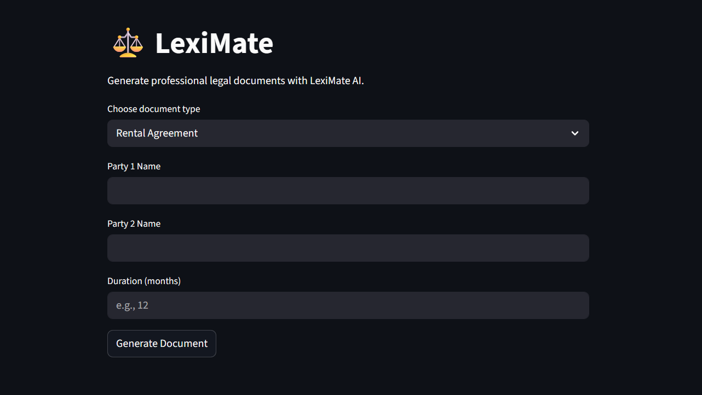

# ⚖️ LexiMate – AI Legal Assistant

LexiMate is an AI-powered legal document generator built with **Streamlit** and **Gemini (Google Generative AI)**. It allows users to generate professional legal documents like rental agreements, employment contracts, NDAs, and more, and export them as beautifully formatted PDF files.

---

## 📸 Demo
 


---

## 🚀 Features

- ✅ Generate 8 types of legal documents using AI
- ✍️ Accepts user inputs like party names, duration, and salary
- 🧠 Uses Google Gemini 2.5 Flash to generate intelligent legal text
- 📄 Exports clean PDF documents using `fpdf` with Liberation Serif or fallback fonts
- 🕒 PDFs are saved with timestamped filenames for uniqueness
- 🌐 Runs on Streamlit with a clean, centered UI

---

## 📂 Document Types Supported

1. Rental Agreement  
2. Employment Contract  
3. Business Partnership Agreement  
4. NDA (Non-Disclosure Agreement)  
5. MOU (Memorandum of Understanding)  
6. Contractor Agreement  
7. Loan Agreement  
8. SLA (Service Level Agreement)

---

## 📦 Tech Stack

| Component     | Tool / Library               |
|---------------|------------------------------|
| Frontend      | Streamlit                    |
| AI Model      | Google Gemini 1.5 Flash      |
| PDF Generation| FPDF with Liberation Serif   |
| Language      | Python 3.x                   |

---

## 🛠️ Installation

1. **Clone the repository**

```bash
git clone https://github.com/yourusername/leximate-ai.git
cd leximate-ai
```

2. **Create a virtual environment (optional)**
```bash
python -m venv venv
source venv/bin/activate  # or venv\Scripts\activate on Windows
```

3. **Install dependencies**
```bash
pip install -r requirements.txt
```

4. **Set up your Gemini API Key**  
Create a `.env` file or export directly:
```bash
# .env file
GEMINI_API_KEY=your_google_gemini_key
```

5. **▶️ Running the App**
```bash
streamlit run app.py
# Then open http://localhost:8501 in your browser.
```

---

## 📁 Project Structure

```bash
leximate-ai/
├── app.py                       # Streamlit frontend
├── legal_assistant.py          # Gemini + PDF logic
├── LiberationSerif-Regular.ttf # Auto-downloaded if missing
├── screenshot/preview.png      # Demo screenshot
├── requirements.txt
└── README.md
```

---

## ✅ Example Output

After entering the party names and other details, you'll:
- See the generated legal document instantly in the browser
- Get a **📄 Download PDF** button to save it with a unique timestamped filename like `generated_document_2025-07-27_21-45-03.pdf`

---

## 📝 Requirements

Save this as `requirements.txt`:
```txt
streamlit
google-generativeai
fpdf
python-dotenv
```

---

## 🙌 Acknowledgements

- Google Generative AI
- FPDF for Python
- Liberation Fonts (via automatic download)

---

Let me know if you'd like:
- 🚀 A GitHub starter kit as a ZIP
- 🖼️ Custom banner image
- ☁️ One-click deployment to Render / Streamlit Cloud
